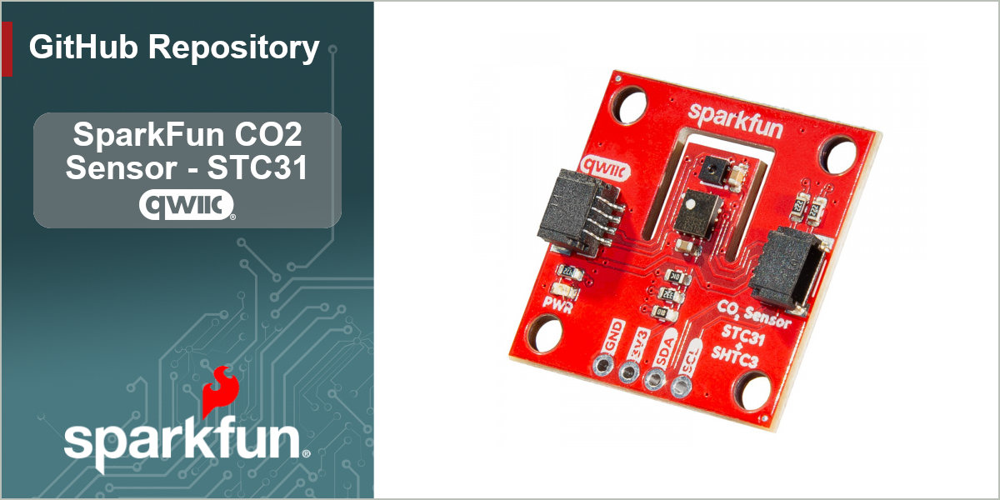

[*SparkFun CO2 Sensor - STC31 (Qwiic) (SEN-29260)*](https://www.sparkfun.com/sparkfun-co2-sensor-stc31-qwiic.html)

The SparkFun CO2 Sensor - STC31 is a Qwiic breakout featuring the STC31 CO2 and SHTC3 Temperature and Humidity sensors from Sensirion&reg; to accurately measure CO2 concentrations up to 100% with high repeatability and long-term stability with humidity and temperature compensation via the built-in SHTC3. 

Repository Contents
-------------------

* **/docs** - GitHub Pages documentation files
* **/Documentation** - Datasheets, application notes, etc.
* **/Hardware** - Eagle design files (.brd, .sch)
* **/Production** - Production panel files (.brd)

Documentation
--------------
* **[STC3x Arduino Library](https://github.com/sparkfun/SparkFun_STC3x_Arduino_Library)** - Arduino library for the SparkFun CO2 Sensor - STC31 (Qwiic).
* **[STC3x Python Package](https://github.com/sparkfun/qwiic_stc3x_py) - Python package for the SparkFun CO2 Sensor - STC31 (Qwiic).
* **[Hookup Guide](https://docs.sparkfun.com/SparkFun_CO2_Sensor-STC31)** - Basic hookup guide for the SparkFun CO2 Sensor - STC31 (Qwiic.

Product Versions
----------------
* [SEN-29260](https://www.sparkfun.com/sparkfun-co2-sensor-stc31-qwiic.html) - SparkFun "Reds" release of the CO2 Sensor - STC31 (Qwiic).
* [SPX-18385](https://www.sparkfun.com/co-sensor-stc31-qwiic.html) - Initial SparkX release of the CO2 Sensor - STC31 (Qwiic)

License Information
-------------------

This product is _**open source**_! 

Please review the LICENSE.md file for license information. 

If you have any questions or concerns on licensing, please contact technical support on our [SparkFun forums](https://forum.sparkfun.com/viewforum.php?f=152).

Distributed as-is; no warranty is given.

- Your friends at SparkFun.