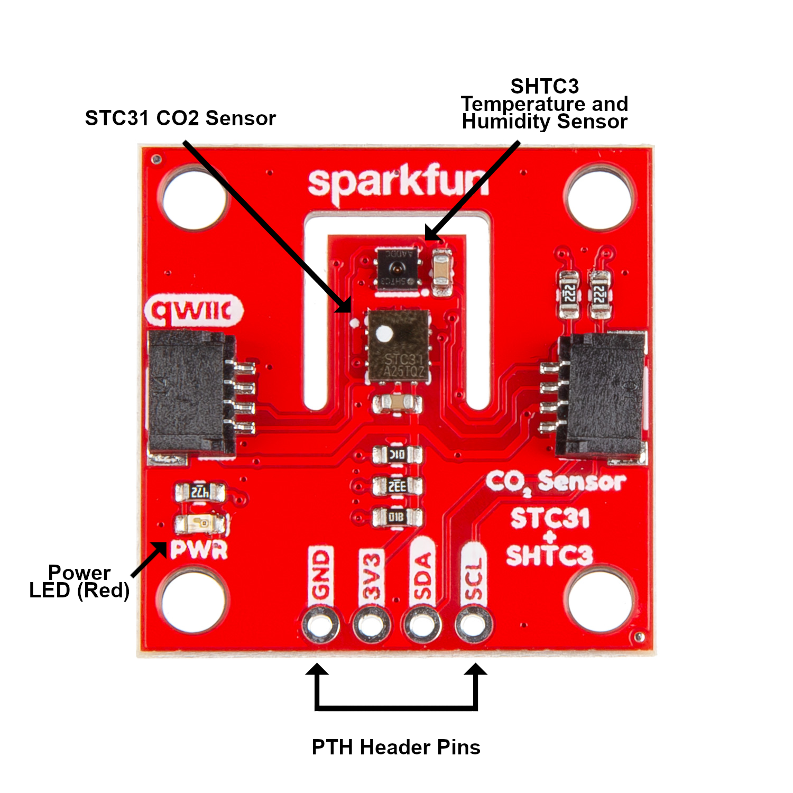

Let's take a closer look at the STC31 CO2, SHTC3 temperature and humidity sensor and other hardware on the SparkFun CO2 Sensor - STC31 breakout.

<figure markdown>
[{ width="600"}](./assets/img/CO2-Sensor-STC31-Annotated.png "Click to enlarge")
</figure>

## STC31 CO2 Sensor

The STC31 CO2 sensor from Sensirion uses Sensirion's patented CMOSens&reg; technology. The STC31 has four operating modes to measure CO2 concentrations from either 0 to 25% volume or 0 to 100% volume in either nitrogen gas (N2) or air (Earth's atmospheric mix of 78.1% N2, 21.0& O2 and 0.9% Ar). When measuring CO2 from 0 to 25% volume the sensor has an accuracy of 0.5% volume + 3% of the measured value. When measuring between 0 and 100% volume the accuracy is 1% volume + 3% of the measured value.

It also has an integrated temperature sensor with a measurement range between -20&deg;C to 85&deg;C and an accuracy of 0.5&deg;C (measuring between 10 to 50&deg;C) and 1.5&deg;C when measuring over the entire temperature range.

The STC31 communicates over I2C  with clock frequencies from 400 to 1000kHz. The sensor has four possible I2C addresses that are set on the board using the address jumpers covered below. The default address is <b>0x29</b>

## SHTC3 Humidity and Temperature Sensor

The STC31 requires temperature and humidity data to get the best CO2 concentration accuracy so we've included the SHTC3 humidity and temperature sensor on the board to provide real time data for both values to the STC31. We chose the SHTC3 both for its accuracy, low power consumption and also because it uses Sensirion's CMOSens technology. The SHTC3 has a temperature measurement range of -40&deg;C to 125&deg;C with an average accuracy of &plusmn;0.2&deg;C. The SHTC3 measures relative humidity between 0 to 100&RH with an average accuracy of &plusmn;2.0%RH.

The SHTC3 communicates over I2C and its I2C address is <b>0x70</b>.

## Qwiic & PTHs

This breakout has a pair of Qwiic connectors as well as a 0.1"-spaced PTH header that all connect to the STC31 and SHTC3's power and I2C pins (VDD/3.3V, Ground, SDA and SCL).

## Power

The two sensors on the board are powered with <b>3.3V</b> through either of the Qwiic connectors or via the <b>3.3V</b> and <b>GND</b> PTH pins. When using the <b>3.3V</b> PTH make sure the supply voltage does not exceed <b>3.6V</b> as that can damage the SHTC3 sensor.

## LED

The sole LED on this breakout is the red Power LED. As the name suggests, this LED indicates when the board is powered on.

## Solder Jumpers

The CO2 Sensor - STC31 has five solder jumpers on the board. The group of three jumpers labeled <b>ADDR</b> adjust the I2C address of the STC31 to the matching address name (0x2A, 0x2B and 0x2C). All three of these jumpers are OPEN by default and set the STC31's I2C address to <b>0x29</b>. Only close one at a time to change the address to the matching name. The jumper labeled <b>LED</b> completes the power LED circuit and is CLOSED by default. Open the jumper to disable the power LED to help reduce the total current drawn by the board. The jumper labeled <b>I2C</b> pulls the I2C lines (SDA and SCL) to <b>3.3V</b> through a pair of 2.2k&ohm; resistors. Open this three-way jumper completely to disable the pullup resistors on those lines if necessary.

## Board Dimensions

This breakout matches the standard Qwiic form factor and measures 1" x 1" (25.4mm x 25.4mm) and has four mounting holes that fit a [4-40 screw]().

