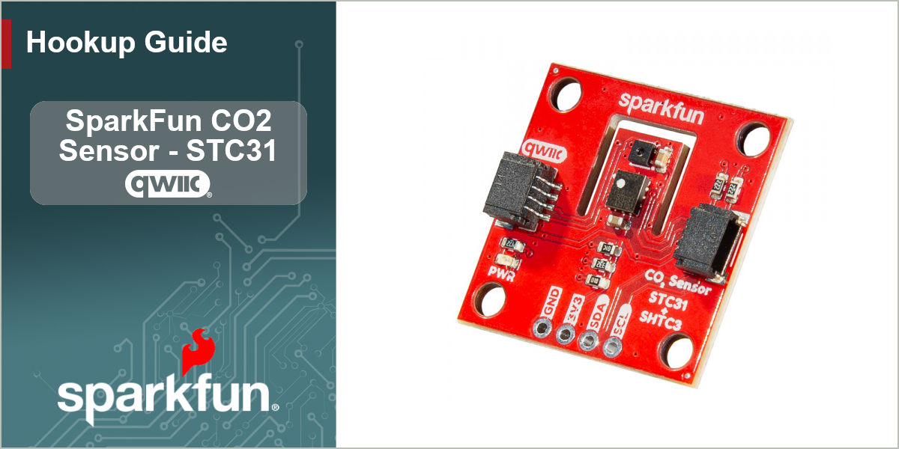

<figure markdown>
[{ width="800"}](./assets/img/CO2-Sensor-STC31-HG-Banner.png)
</figure>

The [SparkFun CO2 Sensor - STC31](https://www.sparkfun.com/sparkfun-co2-sensor-stc31-qwiic.html) is a Qwiic breakout featuring the STC31 CO2 and SHTC3 Temperature and Humidity sensors from Sensirion&reg; to accurately measure CO2 concentrations up to 100% with high repeatability and long-term stability with humidity and temperature compensation via the built-in SHTC3. 

The STC3x sensor family is Sensirion’s series of Gas Concentration sensors designed for high-volume applications. The STC3x utilizes a revolutionized thermal conductivity measurement principle, which results in superior repeatability and long-term stability. This makes the STC31 a perfect choice for applications where reliability is key. The outstanding performance of these sensors is based on Sensirion’s patented CMOSens&reg; sensor technology, which combines the sensor element, signal processing and digital calibration on a small CMOS chip. The well-proven CMOS technology is perfectly suited for high-quality mass production and is the ideal choice for demanding and cost-sensitive OEM applications.

This guide covers how to get CO2 and other environmental readings from the STC31 using both Arduino and MicroPython when connecting the CO2 Sensor Breakout to a compatible development board over Qwiic. In order to follow along with this guide you'll need the CO2 Sensor - STC31 along with the following materials:

* [SparkFun IoT RedBoard - ESP32 MicroPython Development Board](https://www.sparkfun.com/sparkfun-iot-redboard-esp32-micropython-development-board.html) (or other Arduino/MicroPython development board)
* [Qwiic Cable](https://www.sparkfun.com/qwiic-cable-100mm.html)
* [USB-C Cable](https://www.sparkfun.com/usb-a-to-usb-c-cable-1m-usb-2-0-flexible-silicone.html) 

If you prefer a soldered connection, you may need one or more of these materials along with a [soldering iron](https://www.sparkfun.com/tools/soldering/soldering-irons-and-tips.html) and [solder](https://www.sparkfun.com/tools/soldering/solder.html):

* [Breakaway Headers Straight](https://www.sparkfun.com/break-away-headers-straight.html)
* [Jumper Wires - Connected 6" (M/M, 20 pack)](https://www.sparkfun.com/jumper-wires-connected-6-m-m-20-pack.html)
* [Breadboard](https://www.sparkfun.com/breadboard-self-adhesive-white.html)

## Topics Covered

This document contains three main sections: **Quickstart Guide**, **Hardware** and **Software**. 

The Quickstart Guide assumes a working knowledge of how to use a development board and the required software to program them for your project's needs. It covers a quick assembly and then jumps right into getting the necessary software packages installed to start getting spectral data in just a few short minutes.

The Hardware pages are split into the Hardware Overview and Hardware Assembly. The Hardware Overview provides a detailed overview of the CO2 Sensor - STC31 along with all the major components included on the board. Refer to this page for information on things like the STC31, LEDs, pinout and solder jumpers. The Hardware Assembly page covers how to assemble the breakout in both a Qwiic circuit.

The Software pages are split into sections covering the SparkFun STC31 Arduino Library and STCx Python driver. Each software page gives instructions on how to download install the software package (Arduino library or Python driver), as well as detailed looks at the examples included in the software packages.

## Additional Resources

You'll find the board design files (KiCad files & schematic), relevant documentation (datasheets, white papers, etc.) and other helpful links on the **Resources** page. Lastly, the **Support** section includes a Troubleshooting page that includes any helpful tips specific to this board as well as information on how to receive technical support from SparkFun.