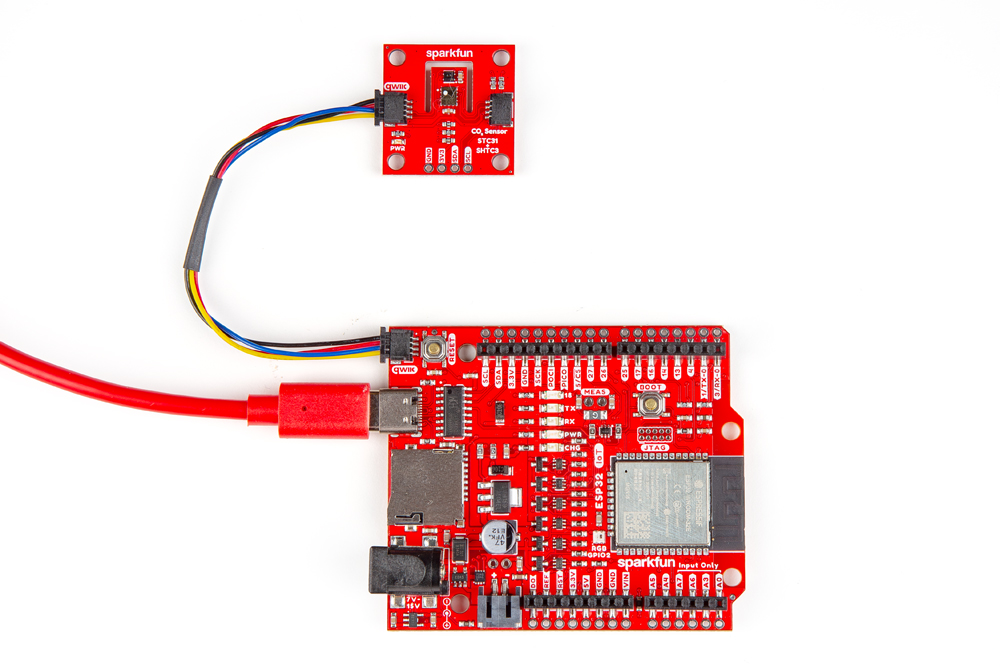
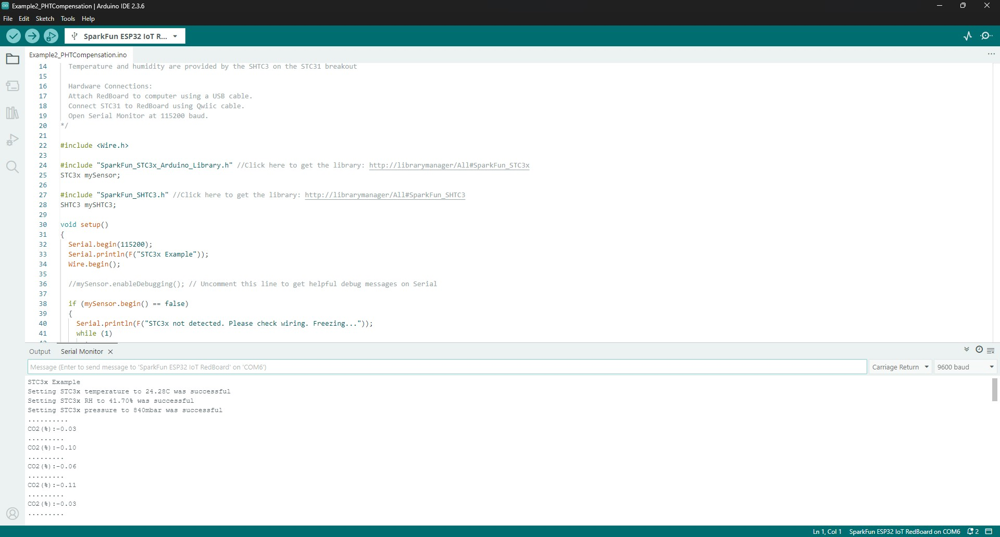

In this Quick Start guide we'll connect the SparkFun CO2 Sensor - STC31 to a SparkFun IoT RedBoard - ESP32 and use the SparkFun STC31 and SHTC3 Arduino libraries to report environmentally compensated CO<sub>2</sub> percentages. This example takes the humidity and temperature data reported by the SHTC3 environmental sensor on the breakout and feeds them to the STC31 to provide accurate CO<sub>2</sub> measurements that are compensated with live environmental data.

If you're not familiar with using sensor breakouts, development boards or the development environments covered in this guide, refer to the [Hardware](./hardware_overview.md) & [Arduino](./arduino_setup.md) sections of this Hookup Guide for a detailed overview of the board along with instructions on setting up and using the SparkFun STC31 and SHTC3 Arduino Libraries.

## Basic Assembly

Since this is a Qwiic breakout, assembling the circuit only requires connecting the sensor breakout to a Qwiic-compatible development board like the IoT RedBoard - ESP32. Connect the STC31 Breakout to the IoT RedBoard with a Qwiic cable and then connect the RedBoard to your computer with a USB-C cable like the photo below:

<figure markdown>
[{ width="600"}](./assets/img/CO2-Sensor-STC31-Assembly.jpg "Click to enlarge")
</figure>

## Arduino Example - PHT Compensation

This [Arduino](https://docs.arduino.cc/software/ide/) example prints out CO<sub>2</sub> concentration percentages compensated with humidity and temperature data measured by the SHTC3 along with a static value for barometric pressure.

* Open the [Arduino IDE](https://docs.arduino.cc/software/ide-v2/tutorials/getting-started-ide-v2/).
* Install the SparkFun STC31 and STHC3 Arduino libraries with the [Arduino Library Manager](https://docs.arduino.cc/software/ide-v1/tutorials/installing-libraries/). Open the tool and search for "SparkFun STC31" and "SparkFun SHTC3". Make sure to install the latest releases.
* If necessary, install board definitions for the IoT RedBoard - ESP32. Open the [Board Manager](https://docs.arduino.cc/software/ide-v2/tutorials/ide-v2-board-manager/) and search for "ESP32" to install the latest release of espressif's ESP32 boards package.
* Open the example in Arduino by navigating to **File** > **Libraries** > **SparkFun STC31 Arduino Library** > **Example2_PHTCompensation**.
* Select your Board and Port and click "Upload".
* Once the code finishes compiling and uploading, open the [serial monitor](https://learn.sparkfun.com/tutorials/terminal-basics/arduino-serial-monitor-windows-mac-linux) with the baud set to **115200** and you should see a printout of the values set for temperature, humidity and pressure followed by values for CO<sub>2</sub> concentration percentage every second like the screenshot below:

<figure markdown>
[{ width="600"}](./assets/img/STC31_Example2.jpg "Click to enlarge")
</figure>

**Code to Note**

The STC31 has four measurement modes to adjust what gas/environment it's measuring in along with the percentage volume of CO<sub>2</sub>. The examples all default to measure up to 25% volume in air. Possible values for `setBinaryGas()` are listed in the code comment below:

``` c++
  //  STC3X_BINARY_GAS_CO2_N2_100   : Set binary gas to CO2 in N2.  Range: 0 to 100 vol%
  //  STC3X_BINARY_GAS_CO2_AIR_100  : Set binary gas to CO2 in Air. Range: 0 to 100 vol%
  //  STC3X_BINARY_GAS_CO2_N2_25    : Set binary gas to CO2 in N2.  Range: 0 to 25 vol%
  //  STC3X_BINARY_GAS_CO2_AIR_25   : Set binary gas to CO2 in Air. Range: 0 to 25 vol%

  if (mySensor.setBinaryGas(STC3X_BINARY_GAS_CO2_AIR_25) == false)
  {
    Serial.println(F("Could not set the binary gas! Freezing..."));
    while (1)
```

Since we don't have a pressure sensor to provide real-time pressure data the example sets the barometric pressure to match the pressure at SparkFun headquarters (840 millibars). You'll most likely want to adjust this value to the pressure in millibars (mbar) to your location. For example, typical barometric pressure at sea level is typically ~1013 millibars.

``` c++
  //If we have a pressure sensor available, we can compensate for ambient pressure too.
  //As an example, let's set the pressure to 840 mbar (== SF Headquarters)
  uint16_t pressure = 840;
```